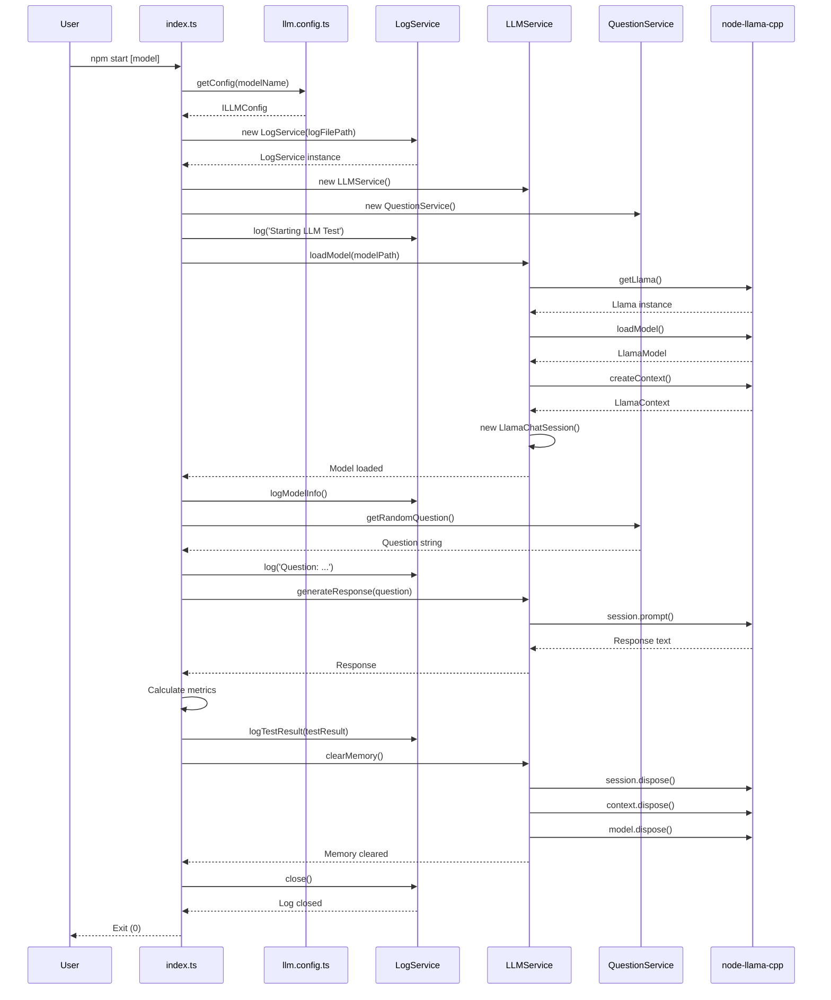

# Architecture Documentation

## Overview

My Assistant AI is a Node.js/TypeScript application designed for testing local LLM models using `node-llama-cpp`. The application follows a modular, service-oriented architecture with clear separation of concerns.

## Architecture Principles

- **Modularity**: Each service handles a specific domain
- **Type Safety**: Full TypeScript with strict mode enabled
- **Interface-Driven**: All services implement defined interfaces
- **Path Aliases**: Clean import structure using aliases
- **Configuration-Driven**: Environment-based configuration

## System Architecture

### Module Structure

```
┌─────────────────────────────────────────────────────────────┐
│                        Application Layer                     │
│                         (index.ts)                           │
└────────────────────────┬────────────────────────────────────┘
                         │
           ┌─────────────┼─────────────┐
           │             │             │
┌──────────▼──────┐ ┌───▼──────────┐ ┌▼───────────────┐
│  Config Module  │ │  Services    │ │  Types Module  │
│  (llm.config)   │ │  Layer       │ │  (interfaces)  │
└─────────────────┘ └───┬──────────┘ └────────────────┘
                        │
          ┌─────────────┼──────────────┐
          │             │              │
┌─────────▼─────┐ ┌────▼──────┐ ┌─────▼────────┐
│ LLM Service   │ │  Log      │ │  Question    │
│ (model ops)   │ │  Service  │ │  Service     │
└───────────────┘ └───────────┘ └──────────────┘
```

## Module Descriptions

### 1. Types Module (`src/types/`)

Defines all TypeScript interfaces and types used across the application.

#### `llm.types.ts`
Contains data structures:
- **ILLMConfig**: Configuration for LLM operations
- **IModelInfo**: Model metadata
- **ITestResult**: Test execution results with performance metrics
- **IAvailableModels**: Available models configuration

#### `services.types.ts`
Contains service interfaces:
- **ILLMService**: Model loading, inference, and memory management
- **ILogService**: Logging operations
- **IQuestionService**: Question generation

### 2. Config Module (`src/config/`)

#### `llm.config.ts`
Manages application configuration:
- Reads environment variables from `.env`
- Resolves model paths (supports `~` expansion)
- Provides configuration objects with defaults
- Validates model availability

**Configuration Flow**:
```
.env file → Environment Variables → getConfig() → ILLMConfig object
```

### 3. Services Layer (`src/services/`)

#### `llm.service.ts` - LLMService

**Responsibilities**:
- Load GGUF models via node-llama-cpp
- Create inference context and chat session
- Generate responses from prompts
- Manage model memory lifecycle
- Provide model information

**Dependencies**:
- `node-llama-cpp` library
- `IModelInfo` type

**Key Methods**:
```typescript
loadModel(modelPath: string): Promise<void>
generateResponse(prompt: string): Promise<string>
getModelInfo(): IModelInfo | null
clearMemory(): Promise<void>
```

**Internal State**:
- `model`: LlamaModel instance
- `context`: LlamaContext for inference
- `session`: LlamaChatSession for chat interactions

#### `log.service.ts` - LogService

**Responsibilities**:
- Initialize and manage log file
- Write structured log entries with timestamps
- Log model information and test results
- Support multiple log levels (info, warn, error, debug)
- Manage log file lifecycle

**Dependencies**:
- Node.js `fs` module
- `ITestResult` type

**Log Format**:
```
[YYYY-MM-DDTHH:mm:ss.sssZ] [LEVEL] Message
```

#### `question.service.ts` - QuestionService

**Responsibilities**:
- Provide predefined test questions
- Randomly select questions for testing
- Support Russian language prompts

**Available Questions**:
1. Recipe generation (100 words)
2. Fairy tale generation (100 words)
3. Birthday greeting for men (100 words)
4. Birthday greeting for women (100 words)

### 4. Available Models

| Model | Parameters | Quantization | Notes |
|-------|-----------|--------------|-------|
| `qwen2.5-1.5b-instruct-q5_k_m.gguf` | 1.5B | Q5_K_M | **Default**, fast inference |
| `qwen2.5-3b-instruct-q5_k_m.gguf` | 3B | Q5_K_M | Balance speed/quality |
| `Qwen3.5-4B-Q5_K_S.gguf` | 4B | Q5_K_S | Higher quality |
| `gemma-4-E2B-it-UD-Q5_K_M.gguf` | 4B (2B eff) | Q5_K_M | Google architecture |

## Application Flow

### Sequence Diagram



### Execution Workflow

```
1. START
   ├─ Parse command line arguments
   └─ Load configuration
     
2. INITIALIZE
   ├─ Create LogService
   ├─ Create LLMService
   ├─ Create QuestionService
   └─ Log startup
     
3. LOAD MODEL
   ├─ Load GGUF model via node-llama-cpp
   ├─ Create inference context
   ├─ Initialize chat session
   └─ Log model info
     
4. EXECUTE TEST
   ├─ Get random question
   ├─ Record start time
   ├─ Generate response
   ├─ Record end time
   └─ Calculate metrics
     
5. LOG RESULTS
   ├─ Log test results
   ├─ Output to terminal
   └─ Write to log file
     
6. CLEANUP
   ├─ Dispose chat session
   ├─ Dispose context
   ├─ Dispose model
   ├─ Close log file
   └─ Exit
     
7. END
```

## Data Flow

### Configuration Data
```
.env → process.env → getConfig() → ILLMConfig → Services
```

### Model Data
```
GGUF file → node-llama-cpp → LLMService → Application
```

### Test Results
```
Question + Response → Metrics calculation → ITestResult → LogService
```

### Log Data
```
Application events → LogService → testllm.log + Console
```

## Error Handling

The application implements comprehensive error handling:

1. **Model Loading Errors**
   - Caught and logged
   - Application exits with error code 1

2. **Inference Errors**
   - Caught and logged
   - Application exits with error code 1

3. **Cleanup Errors**
   - Caught during finally block
   - Ensures exit even if cleanup fails

## Type System

### Core Types

```typescript
interface ILLMConfig {
  modelPath: string;
  modelName: string;
  logFilePath: string;
  contextSize?: number;
  gpuLayers?: number;
  enableLogging: boolean;
}

interface ITestResult {
  modelName: string;
  question: string;
  response: string;
  responseTime: number;
  tokensPerSecond: number;
  contextSize: number;
  memoryMode: string;
  gpuLayers: number;
  timestamp: Date;
}
```

### Service Interfaces

```typescript
interface ILLMService {
  loadModel(modelPath: string): Promise<void>;
  generateResponse(prompt: string): Promise<string>;
  getModelInfo(): IModelInfo | null;
  clearMemory(): Promise<void>;
}

interface ILogService {
  log(message: string, level?: LogLevel): void;
  error(error: string | Error): void;
  logModelInfo(info: Record<string, unknown>): void;
  logTestResult(result: ITestResult): void;
  close(): Promise<void>;
}
```

## Dependencies

### Production
- **node-llama-cpp** (3.18.1): Core LLM inference engine (ESM)
- **dotenv** (16.4.7): Environment variable management

### Development
- **typescript** (5.7.3): Type checking and compilation
- **tsc-alias** (1.8.10): Resolves TypeScript path aliases in output
- **tsx** (4.19.2): TypeScript execution for development
- **@types/node** (22.10.5): Node.js type definitions

## Module System

The project uses **ESM (ECMAScript Modules)** (`"type": "module"` in package.json) because `node-llama-cpp` uses ESM with top-level await. This requires:

- All imports use `.js` extensions (e.g., `from './types/llm.types.js'`)
- TypeScript `module` set to `"NodeNext"`
- Relative imports instead of path aliases in compiled output
- `tsc-alias` to resolve path aliases during build

## Build Process

### TypeScript Compilation
```
src/ → tsc → dist/
```

### node-llama-cpp Build
```
postinstall → build:cpu/build:cuda → Native bindings
```

## Future Extensibility

The architecture supports easy extension:

1. **New Models**: Add to `.env` `AVAILABLE_MODELS`
2. **New Questions**: Add to `QuestionService.QUESTIONS` array
3. **Metrics Collection**: Extend `ITestResult` interface
4. **Additional Services**: Implement service interfaces
5. **Database Integration**: Add new service module
6. **API Layer**: Add HTTP/REST service

## Database Schema

*No databases are used in this project. All data is stored in:*
- **Log files**: `testllm.log`
- **Environment files**: `.env`
- **Model files**: External GGUF files in `~/.local-llm-db/models/`

## Security Considerations

1. **Model Files**: Loaded from user-controlled directory
2. **Environment Variables**: Sensitive configuration in `.env` (gitignored)
3. **No Network Access**: All operations are local
4. **File Permissions**: Log file created with default permissions

## Performance Considerations

1. **Memory Management**: Explicit disposal of model resources
2. **Single-threaded**: Node.js event loop for simplicity
3. **Streaming**: Future enhancement for response streaming
4. **GPU Offloading**: Configurable via node-llama-cpp build options

## Change Log

All future changes and enhancements requested in chat will be documented here and in README.md.
