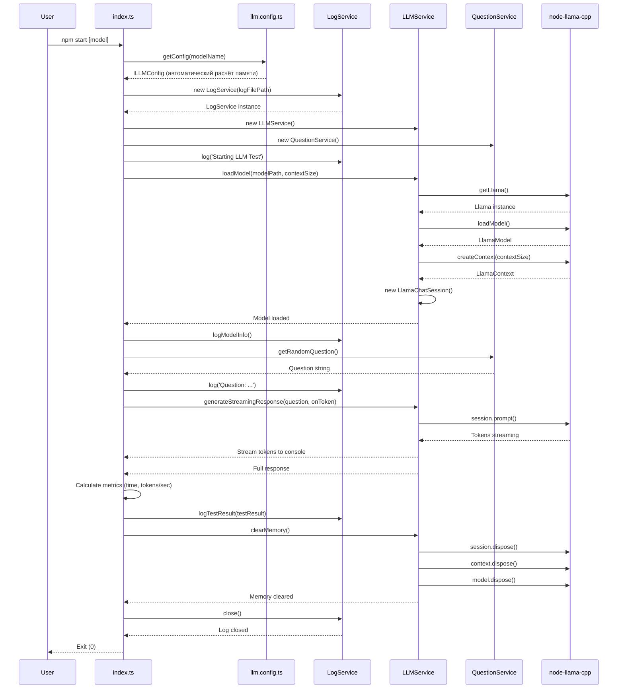
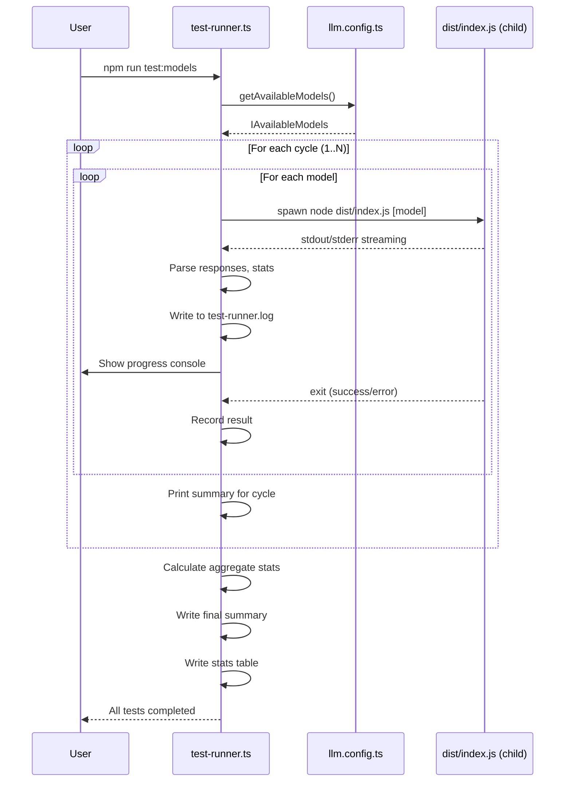

# Архитектура проекта My Assistant AI

## Обзор

My Assistant AI — приложение на Node.js/TypeScript для тестирования локальных LLM моделей с использованием `node-llama-cpp`. Приложение следует модульной сервис-ориентированной архитектуре с чётким разделением ответственности, автоматическим расчётом размера контекста на основе доступной памяти и автоматическим тест-раннером для циклического тестирования.

## Принципы архитектуры

- **Модульность**: Каждый сервис отвечает за свою область
- **Типобезопасность**: Полный TypeScript со строгим режимом
- **Интерфейсно-ориентированная**: Все сервисы реализуют определённые интерфейсы
- **Алиасы путей**: Чистая структура импортов через алиасы
- **Конфигурационно-управляемая**: Настройка через переменные окружения
- **Автоматический расчёт памяти**: Контекст адаптируется под доступную ОЗУ

## Архитектура системы

### Структура модулей

```
┌─────────────────────────────────────────────────────────────┐
│                        Слой приложения                       │
│                     (index.ts, test-runner.ts)               │
└────────────────────────┬────────────────────────────────────┘
                         │
           ┌─────────────┼─────────────┐
           │             │             │
┌──────────▼──────┐ ┌───▼──────────┐ ┌▼───────────────┐
│  Config Module  │ │  Services    │ │  Types Module  │
│  (llm.config)   │ │  Layer       │ │  (interfaces)  │
└─────────────────┘ └───┬──────────┘ └────────────────┘
                        │
          ┌─────────────┼──────────────┐
          │             │              │
┌─────────▼─────┐ ┌────▼──────┐ ┌─────▼────────┐
│ LLM Service   │ │  Log      │ │  Question    │
│ (model ops)   │ │  Service  │ │  Service     │
└───────────────┘ └───────────┘ └──────────────┘
```

## Описание модулей

### 1. Модуль типов (`src/types/`)

Определяет все TypeScript интерфейсы и типы, используемые в приложении.

#### `llm.types.ts`
Содержит структуры данных:
- **ContextSize**: Тип размера контекста (`'auto' | number | { min: number; max: number }`)
- **ILLMConfig**: Конфигурация для LLM операций
- **IModelInfo**: Метаданные модели
- **ITestResult**: Результаты тестирования с метриками производительности
- **IAvailableModels**: Конфигурация доступных моделей

#### `services.types.ts`
Содержит интерфейсы сервисов:
- **ILLMService**: Загрузка моделей, инференс, управление памятью
- **ILogService**: Операции логирования
- **IQuestionService**: Генерация вопросов

### 2. Модуль конфигурации (`src/config/`)

#### `llm.config.ts`
Управляет конфигурацией приложения:
- Читает переменные окружения из `.env`
- Определяет доступную память через `/proc/meminfo` (Linux)
- Автоматически вычисляет размер контекста (ОЗУ - 1ГБ)
- Резолвит пути к моделям (поддерживает `~`)
- Предоставляет конфигурационные объекты с дефолтами
- Валидирует доступность моделей

**Функции**:
```typescript
getAvailableMemoryMB(): number           // Определение доступной памяти
getModelsBasePath(): string              // Получение пути к моделям
getAvailableModels(): IAvailableModels   // Конфигурация моделей
getConfig(modelName?: string): ILLMConfig // Основная конфигурация
```

**Автоматический расчёт контекста**:
```
Доступная память (MB) - 1024 MB = Память для контекста
Макс. токены = (Память_для_контекста * 1024) / 2  // ~2KB на токен
Диапазон: 4096 — 131072 токена
```

**Поток конфигурации**:
```
.env файл → Переменные окружения → getConfig() → Автоматический расчёт → ILLMConfig
```

### 3. Слой сервисов (`src/services/`)

#### `llm.service.ts` — LLMService

**Ответственность**:
- Загрузка GGUF моделей через node-llama-cpp
- Создание контекста инференса и чат-сессии
- Генерация ответов (обычная и стриминг)
- Управление жизненным циклом памяти модели
- Предоставление информации о модели

**Зависимости**:
- Библиотека `node-llama-cpp`
- Тип `IModelInfo`

**Ключевые методы**:
```typescript
loadModel(modelPath: string, contextSize?: ContextSize): Promise<void>
getContextSize(): ContextSize
getActualContextSize(): number | null
generateResponse(prompt: string): Promise<string>
generateStreamingResponse(prompt: string, onToken: (token: string) => void): Promise<string>
getModelInfo(): IModelInfo | null
clearMemory(): Promise<void>
```

**Внутреннее состояние**:
- `llama`: Экземпляр Llama
- `model`: Экземпляр LlamaModel
- `context`: Экземпляр LlamaContext для инференса
- `session`: Экземпляр LlamaChatSession для чат-взаимодействий
- `modelInfo`: Информация о текущей модели
- `contextSize`: Настроенный размер контекста

**Параметры генерации**:
- Температура: 0.7
- Штраф повтора: 1.15 (последние 64 токена)
- Стоп-триггеры: `</s>`, `<|end_of_text|>`, `<|eot_id|>`, `User:`, `AI:`
- Системный промпт: "You are a useful assistant, answer in Russian."
- Flash Attention: включён

#### `log.service.ts` — LogService

**Ответственность**:
- Инициализация и управление файлом логов
- Запись структурированных записей с временными метками
- Логирование информации о моделях и результатов тестов
- Поддержка нескольких уровней логирования (info, warn, error, debug)
- Синхронная запись для обеспечения сохранности данных

**Зависимости**:
- Модуль Node.js `fs`
- Тип `ITestResult`

**Формат логов**:
```
[YYYY-MM-DDTHH:mm:ss.sssZ] [LEVEL] Сообщение
```

**Методы**:
```typescript
log(message: string, level?: LogLevel): void
error(error: string | Error): void
logModelInfo(info: Record<string, unknown>): void
logTestResult(result: ITestResult): void
close(): Promise<void>
```

#### `question.service.ts` — QuestionService

**Ответственность**:
- Предоставление предопределённых тестовых вопросов
- Случайный выбор вопросов для тестирования
- Поддержка русского языка

**Доступные вопросы**:
1. "Напиши рецепт любого блюда на 50 слов"
2. "Напиши сказку на 50 слов"
3. "Напиши поздравление мужчине с днем рождения на 50 слов"
4. "Напиши поздравление женщине с днем рождения на 50 слов"

**Методы**:
```typescript
getRandomQuestion(): string
```

### 4. Точка входа (`src/index.ts`)

Основное приложение для одиночного тестирования модели.

**Поток выполнения**:
1. Получение имени модели из аргументов командной строки
2. Загрузка конфигурации через `getConfig()`
3. Инициализация сервисов (LogService, LLMService, QuestionService)
4. Загрузка модели с автоматическим размером контекста
5. Получение случайного вопроса
6. Генерация стримингового ответа
7. Расчёт метрик (время, токены/сек)
8. Логирование результатов
9. Очистка памяти и завершение

### 5. Тест-раннер (`src/test-runner.ts`)

Автоматический инструмент для циклического тестирования всех доступных моделей.

**Ответственность**:
- Автоматическое обнаружение всех моделей из конфигурации
- Циклический запуск тестов для каждой модели
- Запись результатов в отдельный лог-файл (`test-runner.log`)
- Вывод ответов моделей в реальном времени
- Сбор и агрегация статистики
- Формирование итоговой таблицы результатов

**Ключевые функции**:
```typescript
testLog(message: string, toConsole?: boolean): void
runModelTest(modelName: string, cycle: number): Promise<ModelTestResult>
printResultSummary(result: ModelTestResult): void
printFinalSummary(results: ModelTestResult[]): void
main(): Promise<void>
```

**Структура результатов**:
```typescript
interface ModelTestResult {
  modelName: string;       // Имя модели
  cycle: number;           // Номер цикла
  success: boolean;        // Статус успеха
  question?: string;       // Вопрос
  response?: string;       // Ответ
  responseTime?: string;   // Время ответа
  tokensPerSecond?: string;// Токены/сек
  contextSize?: string;    // Размер контекста
  error?: string;          // Ошибка (если была)
  duration: number;        // Общая длительность теста
}
```

**Особенности**:
- Без задержек между тестами для максимальной скорости
- Перезаписывает лог-файл перед каждым запуском
- Обрабатывает ошибки без прерывания всего процесса
- Показывает ответы моделей в реальном времени во время генерации

## Поток данных

### Конфигурационные данные
```
.env → process.env → getConfig() → Расчёт памяти → ILLMConfig → Сервисы
```

### Данные моделей
```
GGUF файл → node-llama-cpp → LLMService → Приложение
```

### Результаты тестов
```
Вопрос + Ответ → Расчёт метрик → ITestResult → LogService → testllm.log + Консоль
```

### Данные логов
```
События приложения → LogService → testllm.log + Консоль
```

### Данные тест-раннера
```
Циклы тестов → test-runner.ts → test-runner.log + Консоль
```

## Обработка ошибок

Приложение реализует комплексную обработку ошибок:

### 1. Ошибки загрузки модели
- Перехватываются и логируются
- Приложение завершается с кодом ошибки 1

### 2. Ошибки инференса
- Перехватываются и логируются
- Приложение завершается с кодом ошибки 1

### 3. Ошибки очистки памяти
- Перехватываются в блоке `finally`
- Обеспечивается завершение даже при ошибках

### 4. Ошибки в тест-раннере
- Перехватываются без прерывания всего процесса
- Отмечаются как ❌ в результатах
- Позволяют продолжить тестирование других моделей

## Система типов

### Основные типы

```typescript
type ContextSize = 'auto' | number | { min: number; max: number };

interface ILLMConfig {
  modelPath: string;
  modelName: string;
  logFilePath: string;
  contextSize?: ContextSize;
  gpuLayers?: number;
  enableLogging: boolean;
}

interface ITestResult {
  modelName: string;
  question: string;
  response: string;
  responseTime: number;
  tokensPerSecond: number;
  contextSize: number;
  memoryMode: string;
  gpuLayers: number;
  timestamp: Date;
}
```

### Интерфейсы сервисов

```typescript
interface ILLMService {
  loadModel(modelPath: string, contextSize?: ContextSize): Promise<void>;
  getContextSize(): ContextSize;
  getActualContextSize(): number | null;
  generateResponse(prompt: string): Promise<string>;
  generateStreamingResponse(prompt: string, onToken: (token: string) => void): Promise<string>;
  getModelInfo(): IModelInfo | null;
  clearMemory(): Promise<void>;
}

interface ILogService {
  log(message: string, level?: LogLevel): void;
  error(error: string | Error): void;
  logModelInfo(info: Record<string, unknown>): void;
  logTestResult(result: ITestResult): void;
  close(): Promise<void>;
}

interface IQuestionService {
  getRandomQuestion(): string;
}
```

## Зависимости

### Продакшн
- **node-llama-cpp** (3.18.1): Основной движок LLM инференса (ESM)
- **dotenv** (16.4.7): Управление переменными окружения

### Разработка
- **typescript** (5.7.3): Проверка типов и компиляция
- **tsc-alias** (1.8.10): Резолвинг алиасов путей TypeScript
- **tsx** (4.19.2): Выполнение TypeScript в режиме разработки
- **tsconfig-paths** (4.2.0): Поддержка алиасов путей при запуске
- **@types/node** (22.10.5): Определения типов Node.js

## Система модулей

Проект использует **ESM (EcmaScript Modules)** (`"type": "module"` в package.json), потому что `node-llama-cpp` использует ESM с top-level await. Это требует:

- Все импорты используют расширение `.js` (например, `from './types/llm.types.js'`)
- TypeScript `module` установлен в `"NodeNext"`
- Относительные импорты вместо алиасов в скомпилированном выводе
- `tsc-alias` для резолвинга алиасов путей во время сборки

## Процесс сборки

### Компиляция TypeScript
```
src/ → tsc + tsc-alias → dist/
```

### Сборка node-llama-cpp
```
postinstall → build:cpu/build:cuda → Нативные биндинги
```

### Полная сборка
```bash
npm run build  # rm -rf dist && tsc && tsc-alias
```

## Доступные модели

| Модель | Параметры | Квантование | Примечания |
|--------|-----------|-------------|------------|
| `qwen2.5-1.5b-instruct-q5_k_m.gguf` ⭐ | 1.5B | Q5_K_M | По умолчанию, быстрый инференс |
| `qwen2.5-3b-instruct-q5_k_m.gguf` | 3B | Q5_K_M | Баланс скорости/качества |
| `Qwen3.5-4B-Q5_K_S.gguf` | 4B | Q5_K_S | Высокое качество |
| `gemma-4-E2B-it-UD-Q5_K_M.gguf` | 4B (2B eff) | Q5_K_M | Архитектура Google Gemma |

## Последовательность выполнения

### Одиночный тест (index.ts)



### Циклический тест (test-runner.ts)



## Будущая расширяемость

Архитектура поддерживает лёгкое расширение:

1. **Новые модели**: Добавить в `AVAILABLE_MODELS` в `.env`
2. **Новые вопросы**: Добавить в массив `QUESTIONS` в `QuestionService`
3. **Сбор метрик**: Расширить интерфейс `ITestResult`
4. **Дополнительные сервисы**: Реализовать интерфейсы сервисов
5. **Интеграция с БД**: Добавить новый модуль сервиса
6. **API слой**: Добавить HTTP/REST сервис
7. **Параллельное тестирование**: Запускать модели одновременно в test-runner
8. **Сравнение моделей**: Добавить аналитику сравнения метрик

## Хранение данных

*В проекте не используются базы данных. Все данные хранятся в:*
- **Лог файлы приложения**: `testllm.log`
- **Лог файлы тест-раннера**: `test-runner.log`
- **Файлы окружения**: `.env`
- **Файлы моделей**: Внешние GGUF файлы в `~/.local-llm-db/models/`

## Безопасность

1. **Файлы моделей**: Загружаются из директории, контролируемой пользователем
2. **Переменные окружения**: Конфиденциальная конфигурация в `.env` (игнорируется git)
3. **Без сетевого доступа**: Все операции локальные
4. **Права файлов**: Лог файлы создаются с правами по умолчанию
5. **Без инъекций**: Промпты не исполняются как код

## Производительность

1. **Управление памятью**: Явная утилизация ресурсов модели через `dispose()`
2. **Однопоточность**: Event loop Node.js для простоты
3. **Стриминг**: Ответы генерируются и выводятся в реальном времени
4. **GPU оффлоад**: Настраивается через опции сборки node-llama-cpp
5. **Flash Attention**: Включён для оптимизации работы с контекстом
6. **Автоматический расчёт контекста**: Адаптируется под доступную память системы

## История изменений

### Текущая версия
- ✅ Добавлен автоматический расчёт размера контекста на основе доступной памяти
- ✅ Создан тест-раннер для циклического тестирования всех моделей
- ✅ Все ответы и комментарии на русском языке
